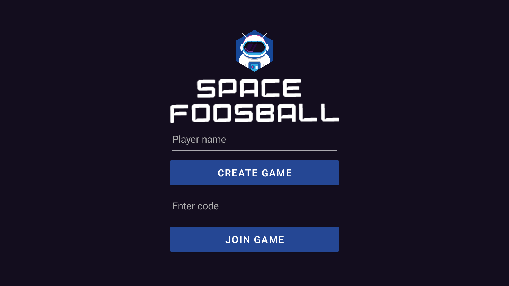
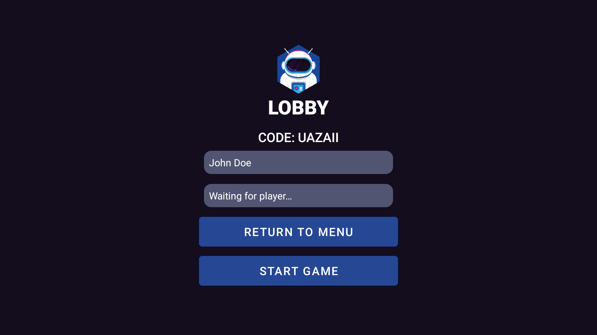
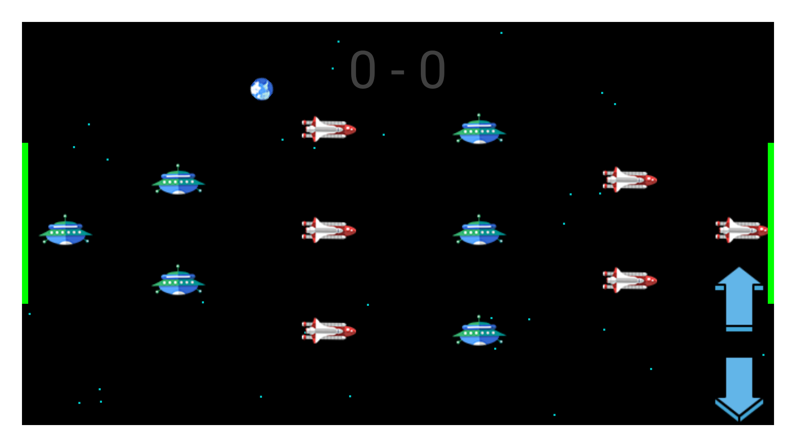

# Foosball

This is a class project for YSC3232 - Software Engineering. It is a multi-player foosball game on
Android.

## Setting Up

To set up, close this repository on your local computer and import as a gradle project in Android
Studio. Upon starting the app, you should see the following screen:

Lobby Screen:

Game Screen:

